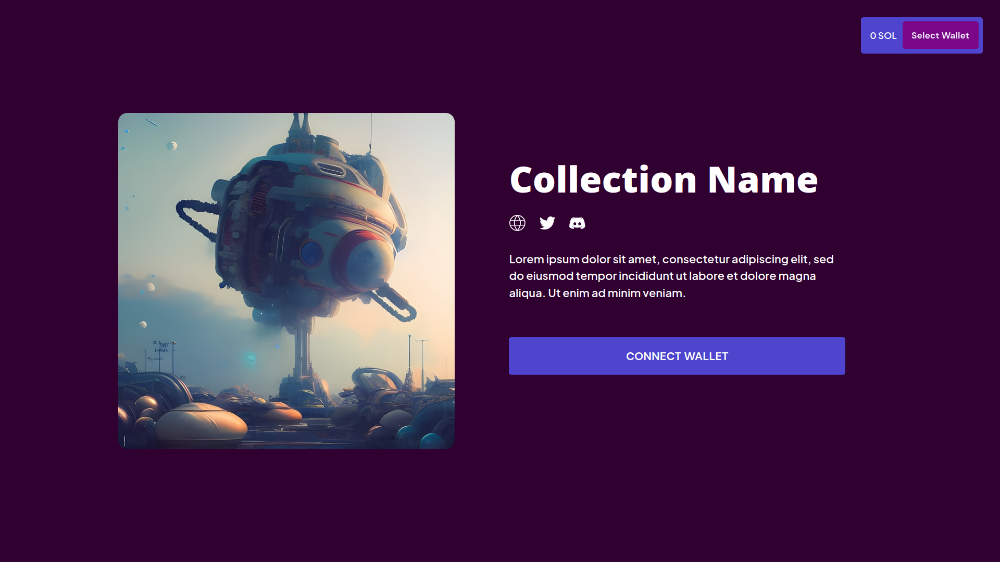

# neo-cmv3

A Web UI for the Candy Machine v3 minting program.

## Preview



Preview it live [here](https://neo-cmv3.vercel.app/).

## Deploy

[](https://vercel.com/new/clone?repository-url=https%3A%2F%2Fgithub.com%2Fcherrynoize%2Fneo-cmv3&env=NEXT_PUBLIC_SOLANA_NETWORK,NEXT_PUBLIC_RPC_HOST,NEXT_PUBLIC_CANDY_MACHINE_ID&project-name=neo-cmv3&repository-name=neo-cmv3)

## Install

    git clone https://github.com/cherri-labs/neo-cmv3/
    cd neo-cmv3
    npm i

Then to run the app:

    npm run dev

or

    npm run build

to create a production build.

## Configuration

- CSS variables in [globals.css](/styles/globals.css)
- title, icon and meta tags in [index.tsx](/pages/index.tsx)
- image slider in [Home.tsx](src/Home.tsx) (near the top)

## Implemented features

- [x] Responsive UI
- [x] Single Mint UI
- [x] Multi Mint UI
- [x] Start Time Countdown
- [x] Preview Minted NFTs
- [x] Guards Supported
  - [x] Start Date
  - [x] End Date
  - [x] Sol Payment
  - [x] Token Payment
  - [x] Mint Limit
  - [x] Bot Tax
  - [x] Token Burn
  - [x] Token Gate
  - [x] NFT Payment
  - [x] NFT Burn
  - [x] NFT Gate
  - [x] Redeemed Amount
  - [x] Address Gate
  - [x] Allow List
  - [x] Gatekeeper

## Multi group 

*For Multi-group functionality use [multi-group](/tree/multi-group) branch*


— Desktop preview of multi group functionality.

*(PS: For optimal use, limit active/ongoing groups to 1 - button will be added automatically for each active group)*

## Env variables

```
NEXT_PUBLIC_SOLANA_NETWORK=mainnet/devnet
```
```
NEXT_PUBLIC_RPC_HOST=networkURL
```
```
NEXT_PUBLIC_CANDY_MACHINE_ID=candyMachineID
```
*If on Vercel or a similar host you need to add these as environmental variables in your project settings.*

## Troubleshooting

Since the Metaplex official repo only provides you with a very
ugly quickstart example, you may still have to `npm i --force` to
solve some dependency issues (or god knows what else),
and you'll still find a bit of a bungalow down in the console
section of your browser. Just try to ignore that. The Candy Machine
still worked as expected for me. I've had similar or same errors
with the very examples provided by Solana Labs as well.

## Credits

Thanks to [wearekite](https://github.com/wearekite/candy-machine-v3-ui) and [Solana Studio](https://github.com/Solana-Studio) for creating the original frontend.

## Contacts

[Contact me](https://cherrynoize.github.io/#/contacts) or [this guy](mailto:hello@kite.studio) if you have some doubts.
